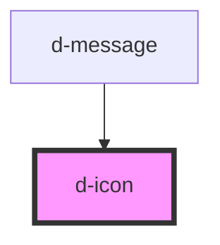

# d-icon

<!-- Auto Generated Below -->

## Properties

| Property | Attribute | Description | Type      | Default     |
| -------- | --------- | ----------- | --------- | ----------- |
| `color`  | `color`   | 图标颜色        | `string`  | `"#333333"` |
| `name`   | `name`    | 图标名称        | `string`  | `"heart"`   |
| `rotate` | `rotate`  | 旋转角度（度数）    | `number`  | `0`         |
| `size`   | `size`    | 图标大小        | `string`  | `"24px"`    |
| `spin`   | `spin`    | 是否启用旋转动画    | `boolean` | `false`     |

## Events

| Event       | Description | Type                      |
| ----------- | ----------- | ------------------------- |
| `iconClick` | 点击事件        | `CustomEvent<MouseEvent>` |

## Dependencies

### Used by

 - [d-message](../d-message)

### Graph

----------------------------------------------

*Built with [StencilJS](https://stenciljs.com/)*
